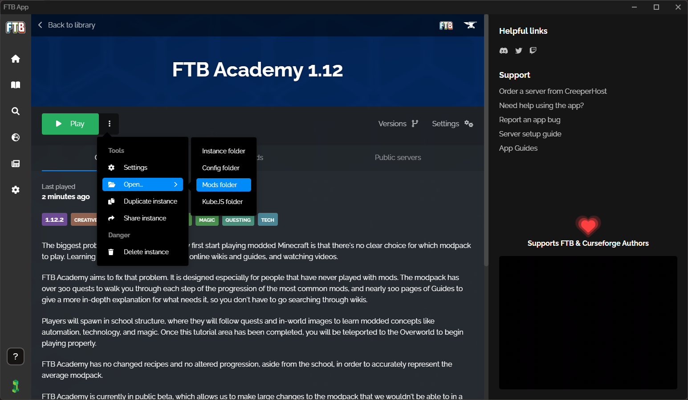
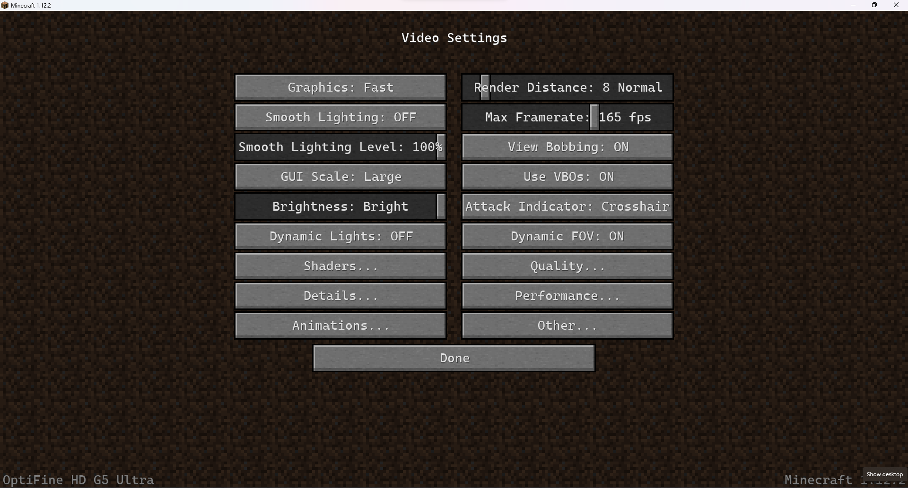
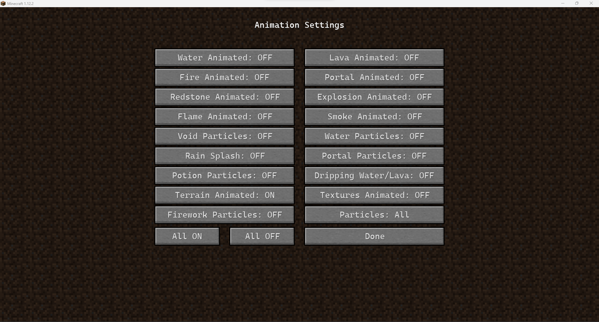
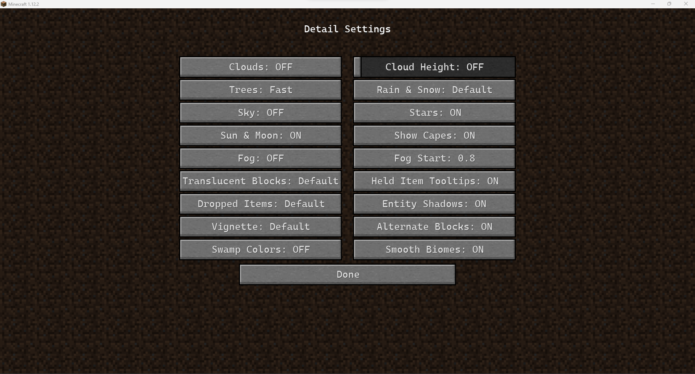

# Setup-Instuctions
Instuctions for seting up the pack

- Both methods are for windows users. 
- If you are using Linux I feel you have the know-how to install the pack yourself.

## First Method:

- This method is for anyone lazy / anyone who doesn't know how to setup java, will probably need more setup if the server pack changes.

### Installing the Ftb-App:
- Go to [The official download page][ftb-app] and Download the app.
- Run through the installer (Probably saved to your Downloads folder) and launch the app.
- Once the app finishes loading, select browse.
- Search for 'FTB Academy 1.12'.

Looks like this:

- Press the green download button, select the '1.4.0' and download it.
- After it finishes downloading press 'Go to Instance'.

If your pc is beafy enough you can press play, login through your microsoft account and minecraft will launch like normal.

If you get an error like this:  \
  \
Just make sure you allow access on private networks and click 'Allow access'

### Installing optifine for a performace boost:
- Go to the [Optifine download page][ODP] and download the ['1.12.2 HD U G5'][JAR] version.
- On the Ftb app, go to your instance, click the 3 dots and open the Mods folder. \
  
- Copy the '.jar' you just downloaded to the 'Mods' folder in the explorer window that just opened.

You can now close the explorer and press play.
### In game settings:
- Video Settings \
  
- Animation Settings \
  
- Details \
  

## Second Method:

### Installing java:
- Go to the [Java Download Website] and download the correct version:
    For Ftb Acadamy we will be using java 8.
-

[ftb-app]: <https://www.feed-the-beast.com/ftb-app>
[ODP]: <https://www.optifine.net/downloads>
[JAR]: <http://optifine.net/adloadx?f=OptiFine_1.12.2_HD_U_G5.jar>